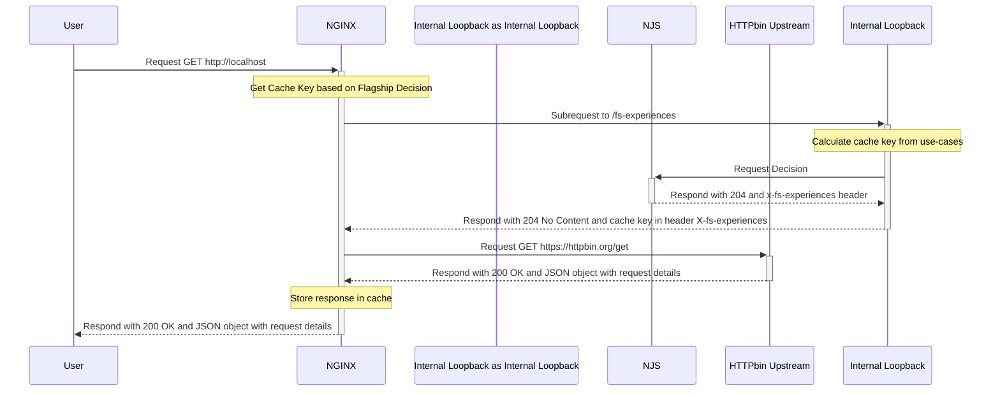

# Flagship-io 🤝 NGINX (Proxy Cache)

This repository contains the necessary files to configure NGINX as a caching proxy server and use the Flagship.io feature management and experimentation platform to vary the content served to end-users.

IN this repo, we used the [NJS build-with module](https://github.com/nginxinc/docker-nginx/blob/1a8d87b69760693a8e33cd8a9e0c2e5f0e8b0e3c/stable/alpine/Dockerfile#L17) of NGINX, included by default _nginx:alpine_ docker image.

# Cache Strategy using NGINX

NGINX is used, among others, as a caching proxy server, which reduces the load on the origin server and speeds up performances. The configuration file for NGINX is available in the [/nginx/conf.d/default.conf](./nginx/conf.d/default.conf) file.

The cache key additionnal criteria is created using Flagship Decision (user experience) and is used to enable NGINX to be aware of the current user experience. The cache key is called _$experienceKey_, and it is appended to leverage the cache of the NGINX proxy.

```INI
proxy_cache_key "$scheme$request_method$host$request_uri$experienceKey";
```

Everyone who should see the same experience (combination of use-cases), will hit the same cache.

# Flagship.io Experiences (Feature Management and Experimentation)

[Flagship.io](https://www.flagship.io) platform for feature management and experimentation, and it is used in this repository to _vary_ the content served to end-users.
It provides a way to create personalized user experiences using A/B testing, feature flags, and user segmentation.

The NJS runtime is used to fetch the experience cache key from Flagship.io and set it as a header in the HTTP response.

The file responsible for fetching the experience cache key is located in the [/nginx/njs/flagship.js](./nginx/njs/flagship.js) file.

# Docker Configuration

This repository uses docker and docker-compose to build and run the NGINX caching proxy server. The [docker-compose.yaml](./docker-compose.yaml) file consists of the configuration for the NGINX container, which includes the Flagship.io environment ID, API key, and timeout. As an example, we use httpbin.org/get as our upstream, allowing us to mimic backend servers and display headers received with JSON response.

Upon launch, the [/nginx/docker-entrypoint.d/21-load-module-njs.sh](./nginx/docker-entrypoint.d/21-load-module-njs.sh) script is utilized to add the load_module (NJS) directive in the NGINX root config, alongside the default [20-envsubst-on-templates.sh](https://github.com/nginxinc/docker-nginx/tree/1a8d87b69760693a8e33cd8a9e0c2e5f0e8b0e3c/stable/alpine-slim) supplied in the image. This script replaces `${ENVVAR}` with the environment variable value present in the docker-compose file.

# Folder structure

```
.
├── docker-compose.yaml
├── nginx
│   ├── conf.d
│   │   ├── default.conf
│   │   └── flagship-dedicated-server.conf
│   ├── docker-entrypoint.d
│   │   └── 21-load-module-njs.sh
│   └── njs
│       └── flagship.js
└── README.md

```

- `docker-compose.yaml`: Docker Compose file for NGINX.
- `nginx/conf.d/default.conf`: NGINX configuration file for the proxy cache and upstream server.
- `nginx/conf.d/flagship-dedicated-server.conf`: NGINX configuration file dedicated to Flagship servers.
- `nginx/njs/flagship.js`: NJS file to generate the cache key using Flagship-io Decision (Cloud-based API request).


